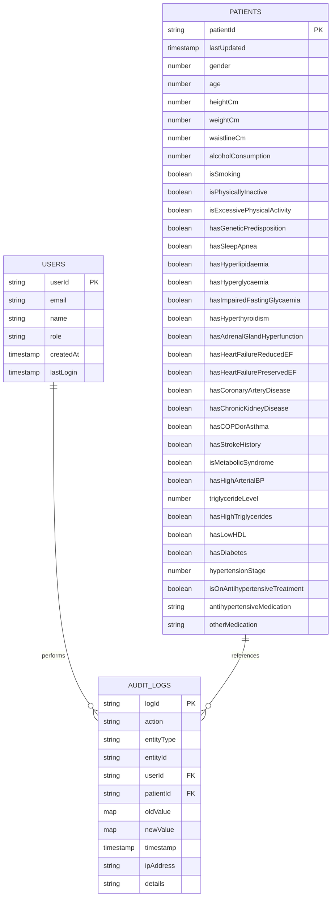

# Database Architecture Diagram



## Collection Hierarchy

```
firestore/
├── users/
│   └── {userId}
│       ├── email
│       ├── name
│       ├── role
│       ├── createdAt
│       └── lastLogin
│
├── patients/
│   └── {patientId}
│       ├── Basic Info (patientId, lastUpdated)
│       ├── Physical Info (gender, age, height, weight, waistline)
│       ├── Lifestyle (alcohol, smoking, activity level)
│       ├── Medical History (boolean condition flags)
│       ├── Current Conditions (metabolic syndrome, BP, diabetes, etc)
│       └── Medications (antihypertensive, other medications)
│
└── auditLogs/
    └── {logId}
        ├── action
        ├── entityType
        ├── userId (references users)
        ├── patientId (references patients)
        ├── oldValue
        ├── newValue
        └── timestamp
```

## Key Indexes

| Collection | Index | Type |
|-----------|-------|------|
| patients | hasDiabetes, lastUpdated DESC | Composite |
| patients | hasHighArterialBP, lastUpdated DESC | Composite |
| patients | isSmoking, hasGeneticPredisposition | Composite |
| patients | isMetabolicSyndrome, age | Composite |
| auditLogs | entityType, timestamp DESC | Composite |
| auditLogs | userId, timestamp DESC | Composite |
| auditLogs | patientId, timestamp DESC | Composite |
